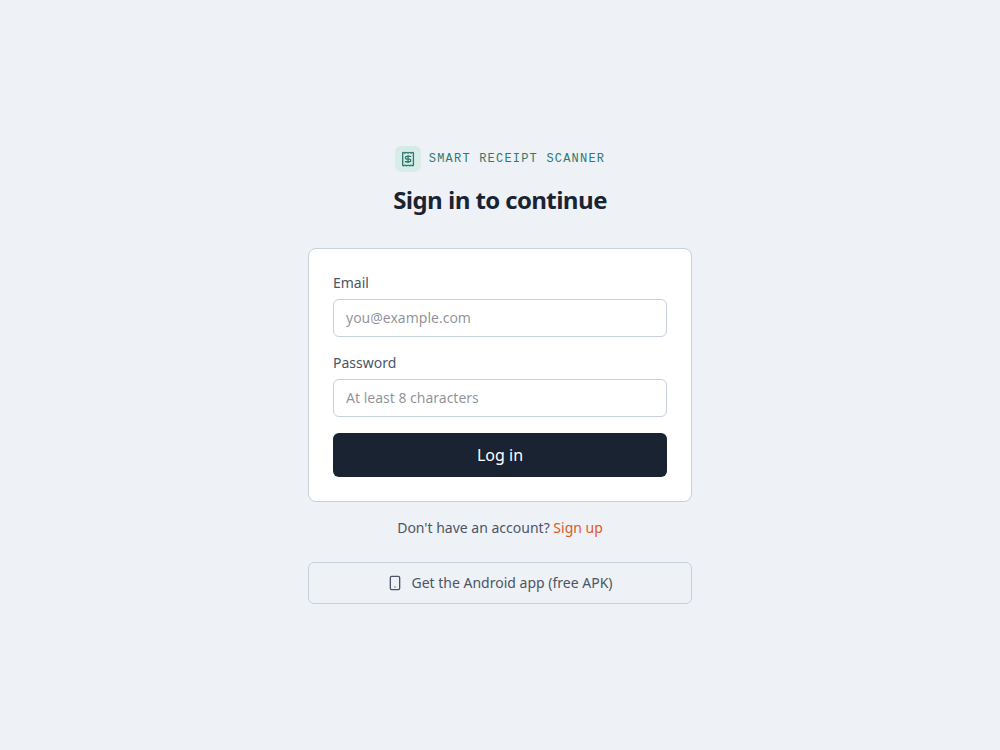
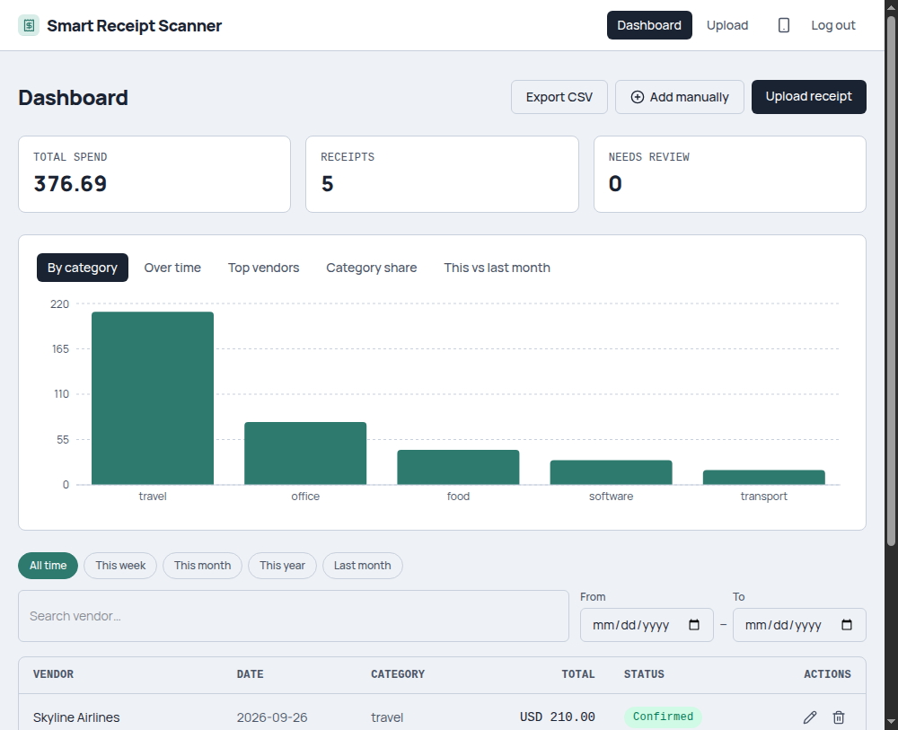
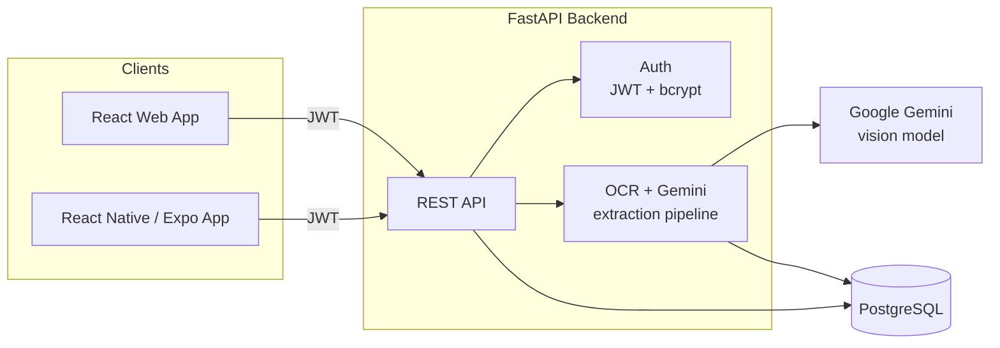

# Smart Receipt Scanner

[](https://github.com/sobanrb404/smart-receipt-scanner/actions/workflows/backend-tests.yml)
[](https://github.com/sobanrb404/smart-receipt-scanner/actions/workflows/web-build.yml)

Snap or upload a photo of a receipt and get back structured, searchable
expense data — vendor, date, total, tax, category, line items — extracted
automatically with OCR + an LLM vision model. Web app, mobile app, and API,
all sharing one account and one dataset.

**Live app:** [receipt-scanner-ochre-two.vercel.app](https://receipt-scanner-ochre-two.vercel.app)
**API:** [receipt-scanner-api-1ss7.onrender.com](https://receipt-scanner-api-1ss7.onrender.com/docs)
**Android:** downloadable APK, linked from the web app's login screen

> Hosted on free tiers (Render + Vercel) — the backend spins down after 15
> minutes idle, so the first request after a while can take 30–50s to wake
> up. Everything after that is normal speed.




## What it does

- **Scan a receipt**: take a photo (mobile) or upload an image (web/mobile).
  Tesseract OCR reads the raw text as a hint; Gemini's vision model reads
  the actual image as the source of truth (OCR alone reliably misreads
  blurry or low-contrast phone photos, e.g. "3" as "S") and returns
  structured fields, validated against a strict schema with confidence
  scores per field.
- **Review & fix**: low-confidence fields are flagged for a quick manual
  check before they land in your data — the app doesn't just trust the
  model blindly.
- **Add manually**: for a receipt you don't have a photo of, or don't want
  to scan.
- **Dashboard**: total spend, per-category breakdown, spend-over-time,
  top vendors, month-over-month comparison, vendor search, date-range
  filters.
- **Export**: CSV export of whatever's currently filtered on the dashboard.
- **One account, every device**: sign up once, see the same receipts on
  web and mobile instantly.

## Why it's built this way

- **Image over OCR text as ground truth** — classical OCR degrades badly
  on real phone photos (glare, blur, skew). Rather than trying to clean up
  OCR output, the LLM call gets the actual image plus OCR text as a
  secondary hint, and is explicitly told to trust the image when they
  disagree.
- **Strict schema + confidence, not blind trust** — the model's JSON output
  is validated against a Pydantic schema and retried on invalid output;
  fields the model itself is unsure about get flagged for human review
  instead of silently saved as fact.
- **Fails gracefully, not silently** — a Gemini API error (rate limit,
  transient outage) is caught and turns the receipt into a "needs review"
  item instead of crashing the background job or hanging it indefinitely.
- **One backend, three clients** — the API doesn't know or care whether
  the caller is the web app, the mobile app, or `curl`; both frontends are
  thin clients over the same REST API and JWT auth.

## Tech stack

| | |
|---|---|
| **Backend** | FastAPI, SQLAlchemy, PostgreSQL, Pydantic, JWT auth (python-jose + bcrypt) |
| **OCR / extraction** | Tesseract + OpenCV preprocessing, Google Gemini (vision, multimodal) |
| **Web** | React, TypeScript, Vite, Tailwind CSS, React Router, Recharts |
| **Mobile** | React Native, Expo (Router, file-based navigation), EAS Build |
| **Infra** | Docker, Render (API + Postgres), Vercel (web), EAS (Android APK) |

## Architecture



## API overview

| Method | Endpoint | What it does |
|---|---|---|
| POST | `/auth/signup`, `/auth/login` | Account creation / JWT login |
| POST | `/receipts` | Upload a receipt image → async OCR+Gemini pipeline |
| POST | `/receipts/manual` | Add a receipt's fields directly, no image |
| GET | `/receipts` | List/search/filter receipts |
| GET | `/receipts/{id}` | Fetch one receipt |
| PATCH | `/receipts/{id}` | Edit fields (e.g. correcting a flagged field) |
| DELETE | `/receipts/{id}` | Delete a receipt |
| GET | `/export/csv` | CSV export, respecting the same filters as the list |

Full interactive docs (Swagger UI) at
[`/docs`](https://receipt-scanner-api-1ss7.onrender.com/docs) on the live API.

## Running it locally

Requires Docker and a free [Gemini API key](https://aistudio.google.com/app/apikey).

```bash
# Backend
cd backend
cp .env.example .env   # add your GEMINI_API_KEY
docker compose up --build

# Web
cd web
npm install
npm run dev

# Mobile
cd mobile
npm install
npx expo start
```

## Project structure

```
backend/   FastAPI app — auth, receipts CRUD, OCR + Gemini pipeline, CSV export
web/       React + Vite dashboard, upload, and review UI
mobile/    Expo/React Native app — camera capture, same account & data as web
```
